<samp>

> Creating and contributing to open-source helps my own and client projects as well as others, so I try to do it wherever possible. This has placed my profile in the top 3%\* of over 100 million GitHub profiles. Many recent contributions are related to [vlang/v](http://github.com/vlang/v) and its ecosystem.

<!--
Store SVG files in the repository and use a weekly update action.
This prevents them from being unavailable due to readme-stats API limits and enables potential historical analysis via the commit history.
-->

  <kbd>toggle more</kbd>

> ## About Me

> Turiiya is actually a Sanskrit name. Spending a good part of my life in an ashram is what brought it to me.
> My social - let's say Muggle-name - is Tobi.
>
> Next to being a computer nerd, I love to snowboard.
> I'm also a licensed fitness trainer and nutritionist, and have volunteered for various organizations for several years.

> **_Some side facts related to coding_**
>
> - Graduation in information technology with focus on multimedia design in 2008.
> - Frist web projects published in 2004, at the age of 13.
> - Around the same time, creating mods and user interfaces for games started a journey of UI and UX development.
> - Today, I program open-heartedly in nearly every language and do a lot of DevOps work.
> - The tally of projects worked on exceeds 250.

> **_Some personal focus tasks_**
>
> - Keep learning _(continuing on a vicious cycle - the more you know, the more you realize that you don't know)_.
> - Work hard, but less. Add sleep, update health, make some babies.
> - More guitar playing.
> - Visit friends in ashram.

\*[anuraghazra/github-readme-stats](https://github.com/anuraghazra/github-readme-stats)

The analysis calculates the global percentile as a weighted sum of a profile's statistics (commits, pull requests, reviews, issues, stars in published repositories, and followers) and based on the cumulative distribution function of the exponential and the log-normal distributions.

</samp>
