	

**Hello there 🙏**

I go by Turiiya. That's a Sanskrit name I got when I spent a good part of my life in the ashram.
My societal - let's say "muggle-name" - is Tobi.

I completed my education in IT with a focus on multimedia technologies in 2008. I'm also a licensed fitness trainer and nutritionist and have volunteered for various organizations for several years.

- 👣 Published my first websites in 2004 at the age of 13 (which wouldn't be that early today I guess).
- 🏆 Had several awarded and top ranking website designs in the following years.
- 🕳️ Creating some user interfaces and mods for games 15+ years ago started me on a journey of UI and UX development.
- 🌐 Today, I program open-heartedly in nearly every language. Except Java. Life is too short to code in Java.
- 👷 Done quite some DevOps work, but haven't found the time to finish the advanced DevOps Pro exam yet.
- 🚀 Would love to do more web3 related work.

 

Personal focus tasks

- 📚 Keep learning _(though, it is a vicious circle, as the more you know, the more you realize that you don't know)_
- 💤 Add sleep
- 💆 Keep my shit together, make some babies, and be a responsible parent (most of the time).
- 🎸 Restring guitar
- 🧘 Visit friends in ashram
- 🏋️ Update health

- 🪟 A proper tiling window manager - gravitating towards <a target="_blank" href="https://github.com/Bismuth-Forge/bismuth">bismuth</a> since 2021, though squinting at hyperland.
- ⌨️ ⌨️ A programmable split keyboard - provides ergos, ~~em~~VIMpowers whole OS navigation (current: keebio iris, bobagum silent switches, blank low-profile keycaps).
- 🧠 Knowledge management tools - atm neovim to manage an obsidian vault. However, it's hard to settle when exceptional software like <a target="_blank" href="https://github.com/siyuan-note/siyuan">siyuan-note</a> is emerging.
- 🔫 The secret sauce is <a target="_blank" href="https://github.com/tenxsoydev/nxvim/">nxvim</a>.

<!--  -->

 

	<section>
		

			
📊 Metrics

			 
			<table align="center">
				<tr>
					<td>
						 
						
						 
						<!-- pseudo img to preserve size on mobile -->
						
					</td>
					<td>
						<em>Default Analysis - Profile Repositories</em> 
						<a href="https://github.com/ttytm"
							></a
						> 
						 
						<em>Indepth Analysis - Public Commits (Category: "Programming")</em> 
						<a href="https://github.com/ttytm"
							></a
						> 
						 
						<em>Default Analysis - Recent Commits (30 Days)</em> 
						<a href="https://github.com/ttytm"
							></a
						> 
						<!-- pseudo img to preserve size on mobile -->
						
					</td>
				</tr>
				<tr>
					<td colspan="2" align="right">
						
							Profile Analysis & Language Activity. Generated with
								<a href="https://github.com/lowlighter/metrics">lowlighter/metrics</a>
						
					</td>
				</tr>
			</table>
		

	</section>
	

		<!--<footer></footer>-->
	

